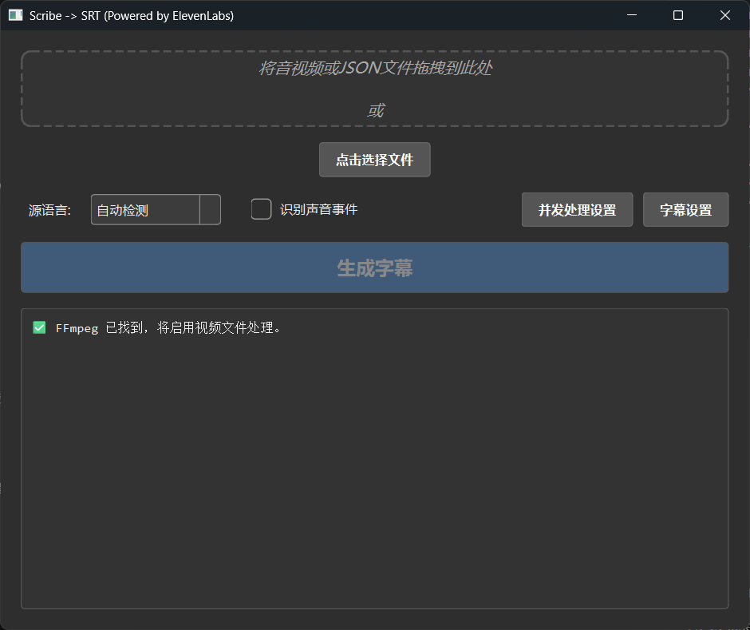

# Scribe to SRT (Powered by ElevenLabs)

[](https://github.com/cylind/scribe2srt/releases/latest)

这是一个使用 Python 和 PySide6 构建的桌面应用程序，它可以将**音频/视频文件**或 **ElevenLabs Scribe 的 JSON 转录文本**通过 [ElevenLabs Speech-to-Text API](https://elevenlabs.io/speech-to-text) 转换为专业的 `.srt` 字幕文件。

本工具旨在简化为视频添加字幕的流程，特别是针对**中文、日文、韩语和英文**内容，提供了智能的字幕切分和格式化规则，以生成高质量、易于阅读的字幕。

## ✨ 功能特性

- **多格式输入**: 不仅支持各类音视频文件，还支持直接处理 ElevenLabs Scribe 生成的 `.json` 文件，跳过上传和转录步骤，直接生成SRT字幕。
- **高效视频处理 (可选)**: 若系统已安装 FFmpeg，在处理视频文件时，应用会自动提取音频流，仅上传音频，极大地减少了上传数据量和处理时间。
- **拖拽操作**: 支持将文件直接拖拽到应用窗口。
- **多语言优化**: 为**中文、日文、韩语、英文**等语言提供了专业的字幕排版规则。
- **专业级字幕引擎**:
    - **智能语义分组**: 通过分析语音中的**停顿**和**标点符号**，将语音智能地组合成符合语义和说话节奏的字幕块。
    - **自动适配行长**: 程序会根据识别出的语言自动采用符合该语言排版规范的**最佳行长**进行换行，无需手动设置。
    - **专业规则集**: 遵循字幕制作规范，包括每秒字符数（CPS）限制、最短/最长显示时间等，以确保最佳阅读体验。
- **声音事件识别**: 可选择识别并标记非语音的声音事件（如 `[音乐]`、`[笑声]`）。
- **跨平台**: 基于 PySide6 构建，支持 Windows, macOS, 和 Linux。

## 🖼️ 应用截图



## 🚀 安装与运行

### 快速开始 (推荐)

对于大多数用户，最简单的方式是直接从我们的 **Releases** 页面下载最新的预编译可执行文件。

1.  **[➡️ 前往最新的 Release 页面](https://github.com/your-username/scribe2srt/releases/latest)**
2.  根据您的操作系统，下载对应的文件（例如 `Scribe2SRT-v1.0.0-windows-x86_64.zip`）。
3.  解压文件，直接运行其中的可执行程序即可。

> **提示 (可选):**
> 为了获得处理视频文件的最佳体验（速度更快，消耗流量更少），建议您在电脑上安装 **FFmpeg**。程序会自动检测并使用它。如果不安装，程序会尝试直接上传整个视频文件，这可能耗时更长。

---

<details>
<summary><b>👨‍💻 开发者：从源码运行</b></summary>

如果您是开发者或希望从源码运行，请按照以下步骤操作。

**1. 克隆仓库**

```bash
git clone https://github.com/your-username/scribe2srt.git
cd scribe2srt
```

**2. (可选, 但强烈推荐) 安装 FFmpeg**

为了最高效地处理视频文件（如 `.mp4`, `.mkv`），强烈推荐您安装 FFmpeg，并将其添加到系统的 `PATH` 环境变量中。

- **Windows**:
  - 从 [FFmpeg 官网](https://ffmpeg.org/download.html) 下载。
  - 解压后，将 `bin` 目录的路径添加到系统的环境变量 `Path` 中。
- **macOS** (使用 [Homebrew](https://brew.sh/)):
  ```bash
  brew install ffmpeg
  ```
- **Linux** (使用 apt,适用于 Debian/Ubuntu):
  ```bash
  sudo apt update && sudo apt install ffmpeg
  ```

您可以在终端或命令提示符中运行 `ffmpeg -version` 来验证是否安装成功。

**3. 创建并激活虚拟环境**

- **Windows**:
  ```bash
  python -m venv venv
  .\venv\Scripts\activate
  ```
- **macOS / Linux**:
  ```bash
  python3 -m venv venv
  source venv/bin/activate
  ```

**4. 安装依赖**

```bash
pip install -r requirements.txt
```

**5. 运行应用**

```bash
python app.py
```

</details>

## 📖 使用说明

1.  **选择文件**:
    - 点击 **"点击选择文件"** 按钮或直接拖拽文件到窗口。
    - 支持的格式包括：
        - **音视频文件**: `.mp3`, `.mp4`, `.wav`, `.mkv` 等。
        - **Scribe转录文件**: `.json`。
2.  **配置选项**:
    - **源语言**: 选择音频的主要语言。如果选择 "自动检测"，ElevenLabs API 会尝试自动识别。
    - **识别声音事件**: 勾选此项后，API会尝试识别并输出 `[音乐]`、`[掌声]` 等非语音事件。
3.  **开始生成**:
    - 点击 **"生成字幕"** 按钮。
    - 应用将开始处理任务，你可以在进度条和日志区域看到当前状态。
4.  **完成**:
    - 任务成功后，会弹出成功的提示框。
    - 生成的 `.srt` 文件（以及可能的 `.json` 文件）会自动保存在与源文件相同的目录下。

## 🛠️ 关于 ElevenLabs API

本工具使用 ElevenLabs 的语音转文本 API。当前版本的代码使用了允许**未经身份验证**的 API 端点，因此**不需要**手动配置 API 密钥。
