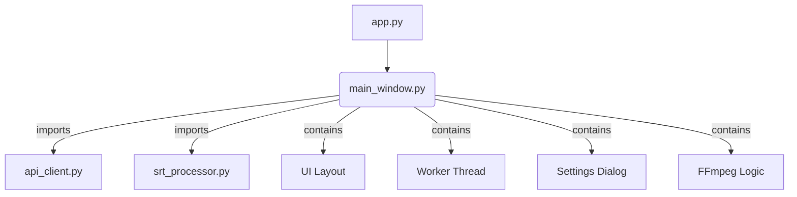

# Scribe2SRT 代码重构计划

本文档旨在规划对 Scribe2SRT 项目的代码结构进行优化，以提高其可读性、可维护性和可扩展性。

## 核心目标

将目前庞大的 `main_window.py` 文件进行拆分，遵循“关注点分离” (Separation of Concerns) 原则，将不同的功能模块化。

## 详细重构步骤

我们将创建新的目录和文件，以重新组织代码库。

### 1. 新建 `ui/` 目录 (存放UI组件)

-   **`ui/main_window_ui.py`**: 存放 `MainWindow` 的UI布局代码 (`setup_ui` 方法的内容)。
-   **`ui/settings_dialog.py`**: 存放 `SettingsDialog` 类。
-   **`ui/widgets.py`**: 存放 `CustomCheckBox` 等自定义控件。

### 2. 新建 `core/` 目录 (存放核心业务逻辑)

-   **`core/worker.py`**: 存放 `Worker` 类，负责后台转录任务。
-   **`core/ffmpeg_utils.py`**: 统一管理所有与 FFmpeg/ffprobe 相关的函数。
-   **`core/config.py`**: 存放应用级的常量，如 `STYLESHEET`, `LANGUAGES`, `SETTINGS_FILE` 等。

### 3. 重构 `main_window.py`

-   移除 `Worker`, `SettingsDialog`, `CustomCheckBox` 类的定义。
-   从新模块中导入UI和业务逻辑。
-   使其核心职责回归到 **UI事件处理** 和 **业务逻辑协调**。

## 结构对比图

### 重构前结构



### 重构后结构

```mermaid
graph TD
    subgraph Application
        A[app.py] --> B_new[main_window.py];
    end

    subgraph UI
        B_new -- imports --> UI_Layout[ui/main_window_ui.py];
        B_new -- imports --> Settings[ui/settings_dialog.py];
        UI_Layout -- contains --> Widgets[ui/widgets.py];
    end

    subgraph CoreLogic
        B_new -- imports --> Worker[core/worker.py];
        B_new -- imports --> FFmpeg[core/ffmpeg_utils.py];
        B_new -- imports --> Config[core/config.py];
        Worker -- imports --> API[api_client.py];
        Worker -- imports --> SRT[srt_processor.py];
        Worker -- imports --> FFmpeg;
        API -- imports --> FFmpeg;
    end